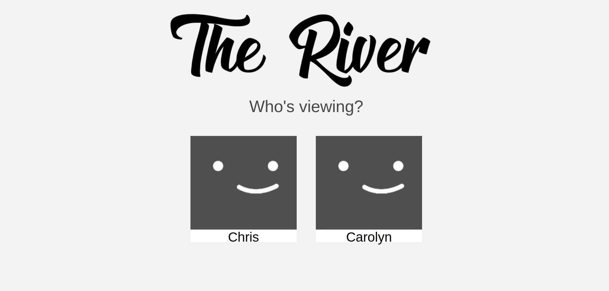
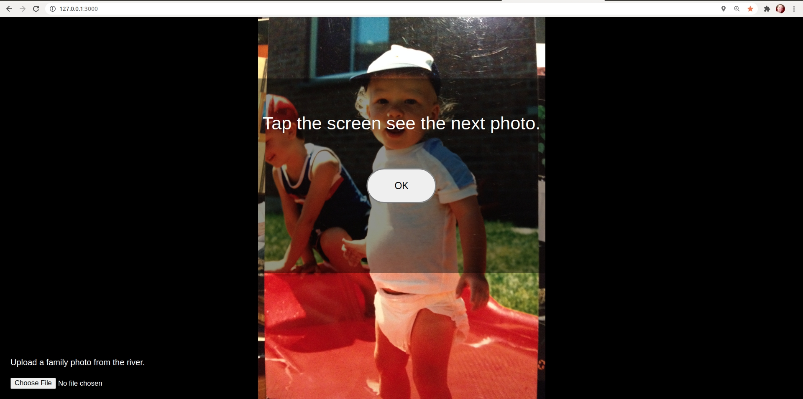

## The River
#### An exploratory app to figure out what factors influence a users viewing pleasure the most.

## QUICK START

Assumes you have the database setup already.
Navigate to the top directory and type in:
'npm start'
then press enter.

## TESTS

- Run 'npm test' to run all unit tests.  100% should be passing.

### TOOLS USED:
- Jest
- Webpack
- VueJS 2.6
- MySQL Server

## LOGIN - Select Predefined Test Subject

## Photo Stream
- Gather data on viewing habits.

# Viewing Analysis
- Uses R-Studio do statistical analysis on MySQL data.

## References

#### rasberry pi zero-w HDMI tv setup.
https://kavi.sblmnl.co.za/making-an-old-tv-smart-using-raspberry-pi-zero-w/

#### webpack
https://webpack.js.org/guides/getting-started/

#### Depends for module imports
https://vue-test-utils.vuejs.org/installation/#using-vue-test-utils-with-jest-recommended

#### install rebar3 for erlang projects.
#### wget https://s3.amazonaws.com/rebar3/rebar3 && chmod +x rebar3

#### mnesia erlang database.
 https://erlang.org/doc/apps/mnesia/Mnesia_chap2.html#getting_started
