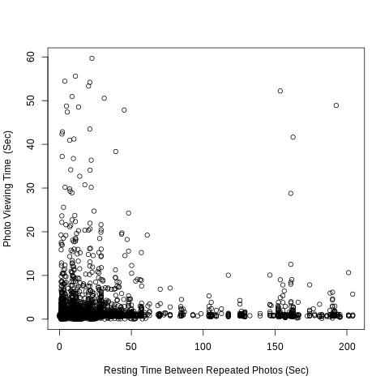

## The River
#### An exploratory app to figure out what factors influence a users viewing pleasure the most.

## QUICK START

Assumes you have the database setup already.
Navigate to the top directory and type in:
'npm start'
then press enter.

## TESTS

- Run 'npm test' to run all unit tests.  100% should be passing.

### TOOLS USED:
- Jest
- Webpack
- VueJS 2.6
- MySQL Server
- R Language

## LOGIN - Select Predefined Test Subject

## Photo Stream
- Gather data on viewing habits.

# Viewing Analysis
- Uses R-Studio do statistical analysis on MySQL data.
- Run *npm run analyze-data* To run analysis of the data.

